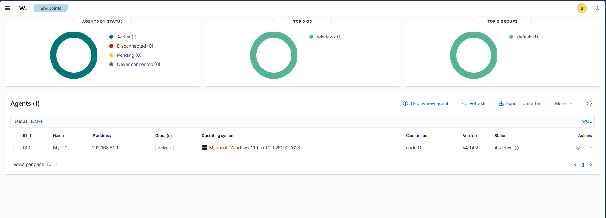
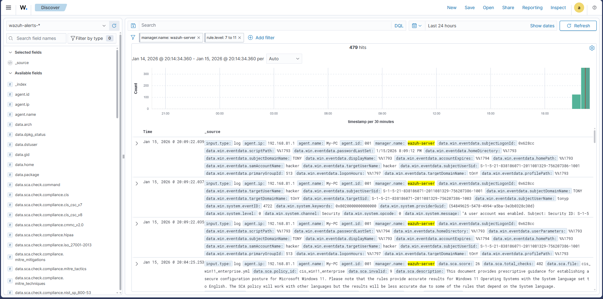
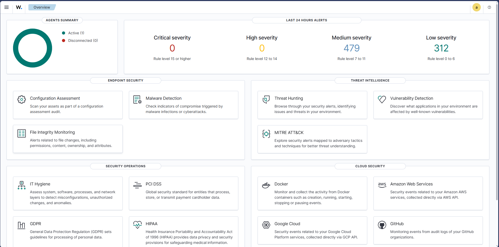

# Home Lab Project: Threat Detection with Wazuh SIEM

## Project Overview
I built this home lab to get hands-on experience with SIEM architecture and log analysis. Instead of just reading about SOC operations, I wanted to simulate an attack on my own network and see if I could configure Wazuh to detect it in real-time.

## Tech Stack
* **SIEM Core:** Wazuh Manager (hosted on Ubuntu 24.04 Server).
* **Endpoint:** Windows 11 Pro (Wazuh Agent installed).
* **Virtualization:** VMware Workstation Pro.
* **Attack Tool:** PowerShell.

## What I Built & Tested

### 1. Infrastructure Setup
I set up the Ubuntu server from scratch. During the initial build, I had to troubleshoot database stability issues, so I re-configured the VM with 50GB storage and 4GB RAM to ensure the Elastic Stack and Wazuh Manager ran smoothly without crashing.

### 2. Agent Deployment
I deployed the Wazuh Agent to my personal Windows laptop to forward system logs to the Ubuntu server. I verified the connection was active and encrypting data between the two machines.

### 3. Attack Simulation (The "Red Team" Phase)
To test the detection rules, I acted as an attacker attempting to establish persistence. I used PowerShell to forcibly create a backdoor user account:
`net user hacker 12345 /add`

### 4. Defense & Analysis (The "Blue Team" Phase)
Wazuh successfully ingested the logs and triggered a security alert. I investigated the dashboard and found the specific telemetry I needed:
* **Event:** User account enabled.
* **Source User:** tony.
* **Target Account:** hacker.
* **Timestamp:** Captured in real-time.

## Results
The system is now fully operational. I successfully went from zero infrastructure to a working detection loop. This lab is currently running and monitoring my local endpoint for security anomalies.

